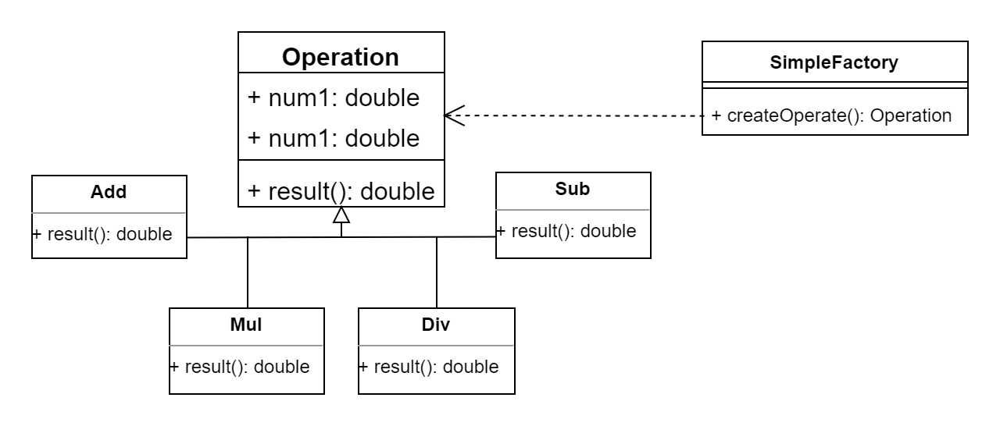
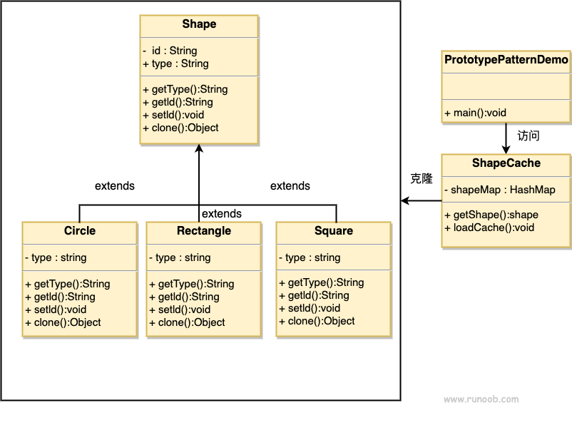
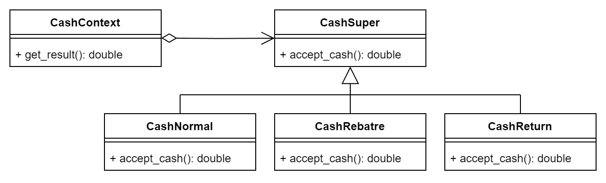
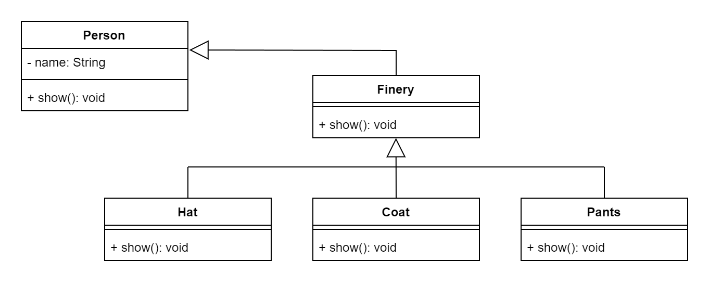
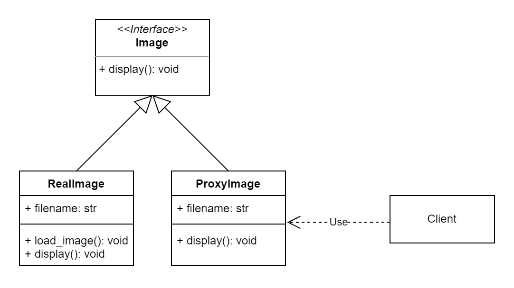

## 介绍

参考菜鸟、大话设计模式并基于 Python 写的设计模式代码，主要是为了学习设计模式的原理，如有纰漏，还请不吝赐教

## 目录结构

### 创建型模式

1. 简单工厂模式
    - 计算器 [calculator.py](patterns/creational/simple_factory/calculator.py)

   - 工厂模式：简单工厂只有一个工厂，而工厂模式需要给每个类都设置一个工厂，符合开闭原则

   - 原型模式 [shape.py](patterns/creational/prototype/shape.py)

### 行为型模式

1. 策略模式
   - 商场收银系统（简单工厂+策略）[cash.py](patterns/behavioral/strategy/cash.py)
 

### 结构型模式

1. 装饰器
   - 服饰穿搭 [finery.py](patterns/structural/decorate/finery.py)：并非一个完美的例子，只是利用的装饰器的特性，一般装饰器类和对象类都会依赖于抽象
   - 服饰穿搭 [finery_pythonic.py](patterns/structural/decorate/finery_pythonic.py)

2. 代理模式
   - 图片加载 [image_proxy.py](patterns/structural/proxy/image_proxy.py)
